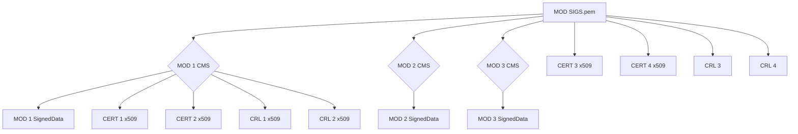
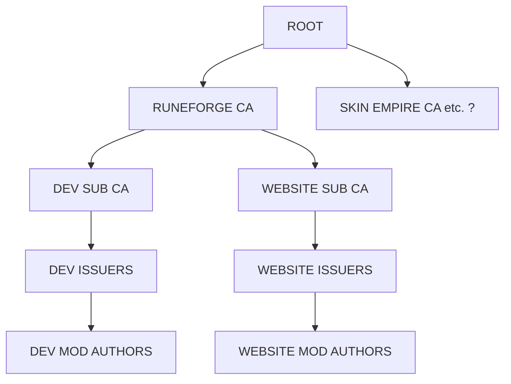

# Mod Authentication

## Mod Signature Format
Each mod **SHALL** present a list of files it wishes to modify.
```c
struct ModSigEntry {
    uint64_t name; // xxh64 of file name
    uint64_t checksum_compressed; // checksum of zstd compressed content as it would be in merged wad file
    uint64_t checksum_uncompressed; // checksum of uncompressed content as it would be in merged wad file 
};

struct ModSigEntryList {
    uint64_t magic = 0x6769736c6f6c7363; // ASCII "cslolsig"
    uint32_t version;                     // must be 0
    uint32_t entry_count;
    ModSigEntry entries[entry_count];    // entries sorted by `name` ascending, no duplicates
}
```
This list will be serialized (little endian) and signed as PKCS7/CMS SignedData message.

## Wad Signature Format
Each original wad file contains a cryptographic signature over its table of contents. This table of contents consists of at least:
| type | description |
| ---- | ----------- |
| u64  | xxh64 of file name |
| u64  | checksum of (un)compressed content as it appears in wad file |

## Mod Verification Process
This is achieved by looking up each entry in the merged wad and checking that it either comes from:
- cryptographically verified original wad's table of contents
- cryptographically verified mod's table of contents

> This may be relaxed to ignore pseudo files like .subchunktoc

## Signature Delivery

By default, each mod signature can function as a standalone payload by bundling its full certificate and CRL chain in a SignedData CMS/PKCS#7 envelope. However, to make delivery of this data to the patcher more convenient, all signatures are bundled into a single `modsigs.pem` file inside the prefix folder. 

This bundle can also contain additional certificates and CRLs added by the mod installer (e.g., when refreshing outdated certificates or CRLs). The mod installer may also opt to remove all bundled CRLs and certificates from each individual CMS SignedData structure and place them in the central bundle to save on overall space and reduce the time necessary to parse the full bundle. It may also remove outdated certificates and CRLs, keeping only the latest ones to further save space and parsing time.




# Certificate Authority Hierarchy



> NOTE: Each CA or Issuer **MUST** also issue a CRL.

## Recommended CRL Update Period

Each Sub CA or Issuer should either set a reasonable time limit for CRL's [nextUpdate](https://datatracker.ietf.org/doc/html/rfc5280#section-5.1.2.5) field or limit its validity period to a reasonable time range.

| name | time |
| ---- | ---- | 
| ROOT | 10 years |
| CA | 6-12 months | 
| SUB CA | 1-3 months | 
| DEV ISSUER | 7-28 days | 
| WEBSITE ISSUER | 14-60 days | 

### ROOT
The Root CA should be fully offline and ideally never touched outside of issuing original CA certificates. Its CRL expiry period should be set to a high value like 10 years.

### CA
Like Root, it should be mostly offline and rarely touched outside of issuing sub CA certificates or in case of a serious breach. Its CRL expiry should be set to a reasonably high value like between 6 months and 1 year.

### SUB CA
Should be periodically refreshed to batch reject multiple bad actors and reduce the overhead of maintaining large issuer CRLs. Its CRL expiry should be set to a 1-3 month period.

### DEV ISSUER
Should be very short-lived to remove bad actors ASAP. Since we can only trust timestamps from executables, our effective time granularity is in the worst case scenario 14 days (30 days on winter holidays), unless Riot pushes an update sooner. Its CRL expiry should be 7-14 days. CRLs support an extension that allows for updating, see [cRLDistributionPoints](https://datatracker.ietf.org/doc/html/rfc5280#section-4.2.1.13). Each dev issuer should map to the person doing approval of end user certificate.

### WEBSITE ISSUER
Websites should be able to prevent most common cases of abuse for any mod that gets uploaded automatically. To reduce overhead on servers requesting new certificates, this should be set to a longer expiry time. However, bad actors will still attempt to bypass such systems in novel and unpredictable ways. To balance between these concerns, multiple issuers are recommended, each with different expiry policies from 7 days to 3 months. Users could automatically be moved to different issuers once they have built sufficient reputation and popularity.

## Developing and testing mods
To make local development easier and less reliant on certificates, signature checking is skipped if any of conditions are true:
 1. Playing replays: first process argument ends with `.rofl`
 2. Playing spectator streams: first process argument starts with `spectator`
 3. Playing on PBE: arguments contain `-PlatformID=PBE1` **and** `-Region=PBE`
 ~~4. Playing in practice tool, no easy way to get this from arguments alone~~

> **Note:** PBE arguments may be spoofed through launcher modifications (e.g., Pengu Loader).  
> It is expected that rito would introduce game-side checks to ensure the correct region is passed to the game if this becomes an issue.

### Dev certificates
When testing in replays/spectator mode is not sufficient, developers can be issued a developer certificate.
Most, if not all, developer certificates should be pinned to a specific summoner ID.  
This is done by setting the certificate subject to:  
`CN=summoner-<hex(sha256(decimal(summonerId)))>`

Since the majority of users do not require developer certificates, this approach should significantly reduce the potential for abuse.

> **Note:** Unpinned developer certificates should be strictly issued only on a need-to basis.

## Technical Limitations and Restrictions in Current Patch
- Only RSA 2048-8192 PKCS#1 signatures supported (artificial limitation for performance reasons)
- Certificates need to be X.509 v3 (rustls webpki limitation)
- CRL webpki does not support:
  - CRL versions other than version 2 (rustls webpki limitation)
  - CRLs missing the next update field
  - CRLs missing certificate revocation list extensions
  - Delta CRLs
  - CRLs larger than (2^32)-1 bytes in size
